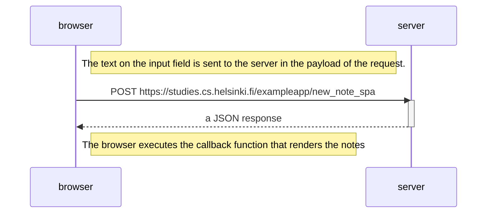

```mermaid
sequenceDiagram
    participant browser
    participant server

    Note right of browser: The text on the input field is sent to the server in the payload of the request.

    browser->>server: POST https://studies.cs.helsinki.fi/exampleapp/new_note_spa
    activate server
    server-->>browser: a JSON response
    deactivate server

    Note right of browser: The browser executes the callback function that renders the notes
```
